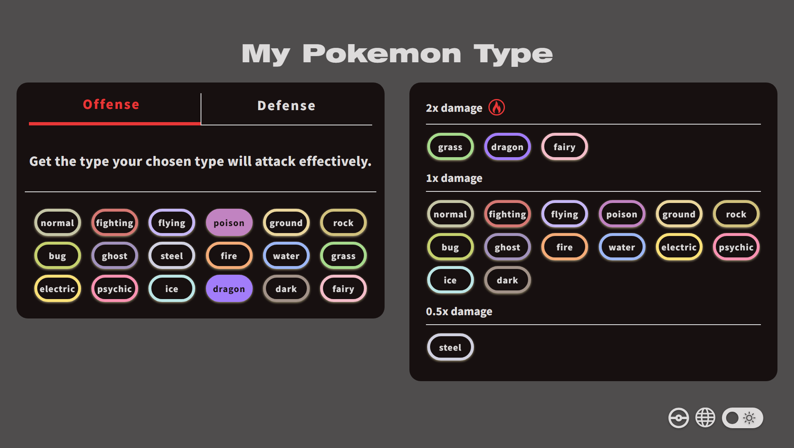

## [개인] 리액트 웹 앱 포켓몬 타입 계산기

> <aside>

> 현재 2025/08/02 마이그레이션 중 | 피그마 페이지: https://lrl.kr/xW4m

<!--## 배포 페이지: https://www.mypkmn.info -->

My Pokemon Type은 포켓몬 배틀에서 가장 중요한 타입 상성을 직관적이고 효율적으로 계산할 수 있도록 돕는 웹 애플리케이션입니다.

사용자는 포켓몬 타입을 최대 2개까지 선택하여 공격과 방어에 있어서 효과적인 타입 상성을 한눈에 확인할 수 있습니다. 직관적인 UI/UX와 개인화된 설정 저장, 다국어 지원을 통해 모든 사용자에게 최적화된 경험을 제공합니다.

다크/라이트 테마, 3개국어 지원을 지원하며 반응형 디자인으로 PC, 태블릿, 모바일 어떤 환경에서도 일관된 사용자 경험을 보장합니다. 사용 후 모든 설정과 선택 기록은 자동으로 저장되어 언제든 이어서 사용할 수 있습니다.

> 자세한 프로젝트 소개, 스택 선정 이유, 도전 과제는 [블로그 포스트 (링크)](https://www.notion.so/stillcorners/21fc7639cb498044bd3ad2ecd7fdbea3#2-%EC%82%AC%EC%9A%A9%ED%95%9C-%EC%8A%A4%ED%83%9D-%EB%B0%8F-%EC%84%A0%EC%A0%95-%EC%9D%B4%EC%9C%A0)를 참고해주세요

> <aside>
> <div style="display: flex; justify-content: center; align-items: center; margin-bottom: 10px;">
> 
> </div>
>
> <div style="display: flex; gap: 10px; justify-content: center; align-items: center; margin-bottom: 20px;">
> 
> 
> 
> </div>
> </aside>

# 사용 스택

### 마이그레이션 이후

- TypeScript, Next.js 15 (App Route), React
- Zustand-persist, i18n
- Tailwind, clsx, Radix UI
- Vercel

### 이전

- TypeScript, React, React-router-dom
- 상태 관리: Redux-toolkit, Redux-persist
- 스타일: Styled-components
- 테스트: Jest
- 배포 및 도메인 관리: AWS Amplify, Route 53
- 디자인: Figma

# 구현 내용

- Redux Toolkit과 Redux Persist를 사용해서 클라이언트 상태를 로컬 스토리지에 저장
  - 유저의 디바이스가 선호하는 다크/라이트 테마 자동 지원
  - 한국어, 영어, 일본어 3개국어 지원
- Styled-components를 사용한 반응형 UI 지원
- AWS Amplify를 사용해서 CI/CD 설정,
- 라이트 하우스 점수 개선: 성능 점수 30점대에서 98점으로 상승
  - FOIT 현상 해결
  - Amplify 빌드 설정을 수정해서 Content-Type 값을 application/javascript 타입으로 변경
  - aria- 속성 사용 및 색상 대비율 개선을 통한 접근성 개선

# 실행 방법

프로젝트 클론 및 의존성 설치를 진행해주세요.

```
git clone https://github.com/stillcorners/mypokemontype.git
cd front
npm install

npm start
```
