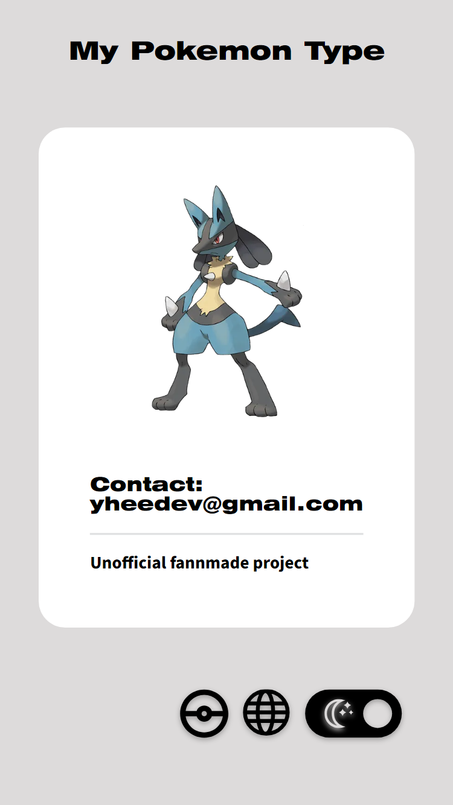
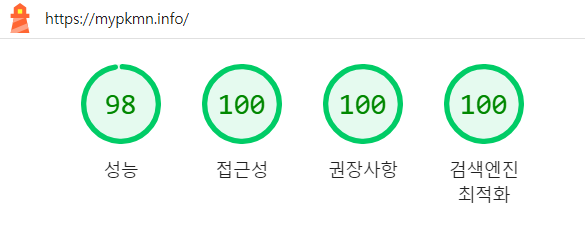

## [개인] 리액트 웹 앱 포켓몬 타입 계산기: [My Pokemon Type](https://mypkmn.info)

> <aside>

> ## 배포 페이지: https://mypkmn.info | 피그마 페이지: https://lrl.kr/xW4m
>
> `My Pokemon Type`은 사용자가 자신 또는 상대방의 포켓몬 타입을 선택하면, 공격과 방어 시 효과적인 포켓몬 타입을 계산하는 반응형 리액트 웹 애플리케이션입니다.
>
> **공격** 계산 시, 선택한 포켓몬 타입이 `공격할 때에 가장 큰 데미지를 줄 수 있는 포켓몬 타입`이 결과에 표시됩니다. **방어** 계산 시, 선택한 포켓몬 타입이 `공격을 받을 때에 데미지를 가장 적게 주는 타입`을 계산해서 결과를 제공합니다.
>
> <div style="display: flex; justify-content: center; align-items: center; margin-bottom: 10px;">
> 
> </div>
>
> <div style="display: flex; gap: 10px; justify-content: center; align-items: center; margin-bottom: 20px;">
> 
> 
> 
> </div>
>
> </aside>

# `My Pokemon Type` README 목차

1. [`My Pokemon Type` 프로젝트의 기능](#1-my-pokemon-type-프로젝트의-기능)
2. [사용한 스택 및 선정 이유](#2-사용한-스택-및-선정-이유)
3. [배운 점 및 도전 과제](#3-배운-점-및-도전-과제)

   1. [모든 상태를 로컬 스토리지에 저장하기](#16-redux-toolkit과-redux-persist-세팅-모든-상태를-로컬-스토리지에-저장하기)
   2. [사용자 기기 선호 테마에 따라 다크/라이트 테마 지원](#26-사용자-기기-선호-테마에-따라-다크라이트-테마-지원)
   3. [사용자 위치에 따라 자동으로 언어 지원](#36-사용자-위치에-따라-자동으로-언어-지원)
   4. [AWS Amplify를 사용한 배포](#46-aws-amplify를-사용한-배포)
   5. [포켓몬 타입의 공격 계산 함수와 방어 계산 함수 구현과 테스트](#56-포켓몬-타입의-공격-계산-함수와-방어-계산-함수-구현과-테스트)
   6. [라이트 하우스 점수 개선 (성능 30점대 → 98점, 그외 모두 100점)](#66-라이트-하우스-점수-개선-성능-30점대--98점-그외-모두-100점)

## 1) `My Pokemon Type` 프로젝트의 기능

1. 사용자가 웹 앱에 접속해서 포켓몬 타입을 선택하면 결과에서 그 포켓몬 타입이 공격하거나 방어할 때에 가장 효율적인 타입을 계산 결과를 보여줍니다.

2. 사용자 기기의 선호 테마에 따라 자동으로 다크 모드 또는 라이트 모드로 설정됩니다.

3. 사용자의 위치에 따라 국가권에 맞는 언어가 자동으로 지원됩니다. 사용자의 위치가 영어권이라면 영어로, 일본이면 일본어로, 그외에는 기본으로 한국어가 지원됩니다.

4. 사용자가 선택했던 포켓몬 타입과 그에 따른 계산 결과, 다크/라이트 테마, 언어 등의 선택은 모두 로컬 스토리지에 저장됩니다.

5. 반응형 UI를 구현해서 PC, 태블릿, 모바일 기기에서 접속이 가능합니다.

6. 사용자가 셀렉터에서 포켓몬 타입을 최대 2개까지만 클릭 가능하도록 만들어서 실용성을 개선했습니다. 또한 결과 컴포넌트에서는 가장 효과적인 타입에 강조 아이콘을 사용하고 공격과 방어 결과 간의 배치 순서를 바꿔서 사용자가 보다 직관적으로 최적의 포켓몬 타입을 선택할 수 있도록 기획해서 사용자 경험 향상을 고민했습니다.

## 2) 사용한 스택 및 선정 이유

- 배포/AWS: `Cloudfront`, `Amplify`, `Route 53`
- 상태 관리: `Redux-toolkit`, `Redux-persist`
- 프론트엔드 라이브러리: `React`, `React-router-dom`
- 언어 및 타입 시스템: `TypeScript`
- 테스트 도구: `Jest`
- 스타일: `Styled-component`
- 디자인: `Figma`

### 배포/AWS: `Cloudfront`, `Amplify`, `Route 53`

`Amplify`는 리액트 애플리케이션을 빠르고 효율적으로 배포할 수 있다는 점 덕분에 사용해보았습니다. AWS Amplify 콘솔에서 몇 가지 설정만으로 손쉽게 배포를 할 수 있다는 점이 무척 편했고 서버 설정 외에 프론트엔드 개발에 집중할 수 있다는 점이 좋았습니다. 특히 `Amplify`는 코드를 푸시하면 자동으로 빌드 및 배포가 이루어지는 CI/CD 파이프라인을 제공하여, 배포 과정을 매우 간편하게 만들어주었습니다.

`Route 53`은 AWS의 DNS 웹 서비스로, `Amplify`에서 제공하는 기본 도메인 대신에 제가 구입한 도메인인 `mypkmn.info`를 사용하기 위해 선택했습니다. 그외에도 AWS의 다른 서비스와 원활하게 통합되어 관리가 용이했습니다.

`Cloudfront`는 AWS의 콘텐츠 전송 네트워크(CDN) 서비스로 전 세계에 분산된 엣지 로케이션을 통해 사용자에게 빠르고 안정적으로 콘텐츠를 전달할 수 있습니다. 사용자의 위치 기반으로 자동으로 언어를 지원하는 기능을 구현하기 위해서 `cloudfront-viewer-country` 헤더를 사용하여 사용자의 위치를 파악하고, 이에 따라 웹 앱의 언어를 자동으로 설정할 수 있습니다.

이와 같은 이유로 `Cloudfront`, `Amplify`, `Route 53` 스택을 채택하여 프로젝트를 진행하였습니다. 이 스택을 사용해서 배포한 자세한 과정은 아래 블로그 링크에 포스트를 해두었습니다.

https://stillcorners.notion.site/CI-CD-3-64a96d7866f94484817f933f8e42a081

### 상태 관리: `Redux Toolkit`, `Redux-persist`

`Redux Toolkit`은 FLUX 아키텍처를 기반으로 중앙 집중식 상태 관리를 효율적으로 할 수 있도록 도와줍니다. 이를 통해 애플리케이션 상태 관리를 일관성 있게 유지하고 에러가 난 부분을 추적하기 쉽습니다. 또한 `Redux Toolkit`은 상대적으로 `Redux` 보다 더 간편하게 설정할 수 있기 때문에 선택했습니다.

`Redux Persist`는 리덕스 스토어의 상태, 즉 사용자가 선택했던 포켓몬 타입, 언어, 다크/라이트 테마 등을 로컬 스토리지에 저장합니다. 이를 통해 사용자가 페이지를 새로고침하거나 페이지를 닫더라도 상태가 유지되도록 도와줘서 사용자 경험이 향상된다는 장점이 있습니다.

### 프론트엔드 라이브러리: `React`, `React-router-dom`

`React`는 컴포넌트 기반의 라이브러리로, 컴포넌트 UI를 효율적으로 구축하고 재사용하기 용이했습니다. `React`를 사용하면서 확실히 코드의 중복이 줄어들었다는 장점이 있었습니다. 또, SPA 특유의 빠른 렌더링 덕분에 페이지 전환이 매우 빠르다는 점이 좋았습니다.

`React Router DOM`은 리액트 애플리케이션에서 라우팅을 관리하는 라이브러리입니다. 사용자가 `/` 외에 `/defense`, `/more` 과 같은 기존과 다른 URL에 접속할 때에 해당 URL 파라미터에 지정한 컴포넌트들 전체를 렌더링합니다. 그래서 비교적 간단한 과정으로 페이지 전환을 쉽게 구현할 수 있었습니다.

### 언어 및 타입 시스템: `TypeScript`

`TypeScript`는 타입을 명시해서 코드의 안전성과 가독성을 높일 수 있었습니다. 코드 작성 시 자동 완성이 되는 기능, 타입을 체크하는 기능, 타입 정의를 통해 변수와 함수들의 의도를 명확하게 해서 유지 보수를 용이하게 할 수 있다는 장점이 좋았습니다.

### 테스트 도구: `Jest`

테스트 코드를 처음 작성하기 위해 `Jest`를 사용해서 테스트 해보았습니다. `Jest`를 통해 함수의 테스트를 효율적으로 작성하고 안정성을 높일 수 있었습니다.

### 스타일: `Styled-components`

`Styled-components`는 CSS-in-JS 라이브러리입니다. `Styled-Components`는 리액트 컴포넌트와 로직, 스타일을 결합해서 한 곳에서 모두 작성하고 관리할 수 있다는 사용할 수 있다는 장점이 있습니다.

또한 자바스크립트 코드를 작성하지 않더라도 `Styled-component`에서 props를 통해 다크 모드와 라이트 모드에 따라 다른 스타일을 적용하도록 작성할 수 있다는 점이 좋았습니다. 그리고 이렇게 작성한 스타일을 재사용할 수 있기 때문에 효율적이였다.

### 디자인 도구: Figma

`Figma`는 대표적인 협업 디자인 도구로 알려져 있습니다. 제가 프론트엔드 개발자로 성장하기 위해 `Figma`를 기본적으로 다룰줄 안다면 디자이너와 협업하거나 디자인을 참고하는 등의 상황에서 원활해질 수 있다는 생각이 들어서 `Figma`를 사용해서 디자인을 해보았습니다.

## 3) 배운 점 및 도전 과제

### 1/6) `Redux Toolkit`과 `Redux Persist` 세팅: 모든 상태를 로컬 스토리지에 저장하기

1. `RootState`, `persistConfig`, `rootReducer` 정의하기: `RootState`는 애플리케이션의 전체 상태 트리를 나타내는 타입입니다. 리듀서에 저장하려는 모든 기능들을 `RootState`에 작성하는게 필요합니다. 그 다음에 `persistConfig`를 통해 상태를 로컬 스토리지에 저장하도록 설정할 수 있습니다. 그리고 프로젝트에서 여러 상태를 관리하기 위해 각 상태별로 세부 `reducer`를 정의하고, 이를 하나의 `rootReducer`로 결합할 수 있습니다.

2. `store` 설정: `rootReducer`를 정의한 후, 이를 store와 연결합니다. `Redux Persist`를 사용하여 `rootReducer`에 포함된 모든 상태를 로컬 스토리지에 저장하고, 애플리케이션이 다시 로드될 때 상태를 복원할 수 있도록 설정할 수 있습니다.

3. `useSelector`, `useDispatch` 사용: `Redux Toolkit`에서 정의한 리듀서들을 `useSelector`, `useDispatch` 훅을 사용하여 액션을 디스패치하고 상태를 선택할 수 있습니다. 이 두 훅을 사용하면 컴포넌트에서 Redux 상태와 상호작용하는 것이 간편해집니다.

- `useSelector`는 Redux 스토어의 상태를 선택하는 데 사용됩니다. 컴포넌트는 `useSelector`를 통해 필요한 상태를 구독하고, 상태가 변경될 때마다 자동으로 리렌더링됩니다.
- `useDispatch`는 Redux 스토어에 액션을 디스패치하는 데 사용됩니다. 컴포넌트는 useDispatch를 통해 액션을 디스패치하여 상태를 변경할 수 있습니다.

저는 `Redux Toolkit`을 상태 관리에 대한 개념을 익혀보기 위해 이 프로젝트에서 처음 사용해보았습니다. 개인적으로 백지 상태에서 처음 세팅하기가 무척 어려웠고 상대적으로 러닝 커브가 높은 편이었습니다. 하지만 중앙 집중식 상태 관리 덕분에 일관성 유지와 디버깅이 용이했고, 처음 목적이였던 상태 관리에 대한 개념을 잘 익힐 수 있었기 때문에 만족스러웠습니다.

처음엔 어려웠지만 한 번 세팅을 해두니까 이후 스토어에 다국어 지원, 공격 함수 등 다양한 기능을 추가하기가 편했던 것도 꽤 만족스러웠습니다. 다음에는 `Flux` 아키텍처 외에 `Recoil`과 같은 다른 상태 관리 라이브러리를 사용해보고 싶습니다.

### 2/6) 사용자 기기 선호 테마에 따라 다크/라이트 테마 지원

1. `styled-components`를 통한 다크/라이트 테마 작성: `styled-components`를 사용하여 다크/라이트 테마 스타일을 따로 정의하고, 이를 컴포넌트에 적용했습니다. 테마는 Redux 상태를 통해 된리됩니다.

2. 사용자 선호 테마에 따라 동적으로 적용: 애플리케이션에 있는 다크모드 버튼을 누르면 다크모드 리듀서 액션이 디스패치 됩니다. 이를 통해 리덕스 상태가 업데이트 되고 `styled-component`로 작성한 테마가 변경 됩니다. 또한 사용자의 시스템 테마 설정을 감지해서 초기 테마를 설정할 수 있는데, 이 기능을 구현하기 위해 `window.matchMedia API`를 사용했습니다.

### 3/6) 사용자 위치에 따라 자동으로 언어 지원

`<My Pokemon Type>` 프로젝트는 `CloudFront`를 사용하여 사용자의 위치를 감지하고, 해당 위치에 맞는 언어를 자동으로 설정하는 기능을 제공합니다. 영어권 국가라면 영어(`us`), 일본이라면 일본어(`jp`), 그 외에는 기본으로 한국어(`kr`)를 설정합니다.

1. CloudFront 헤더 사용: CloudFront는 `cloudfront-viewer-country` 헤더를 통해 사용자의 국가 코드를 제공하고, 이를 통해 사용자의 위치를 감지할 수 있습니다.

2. Redux 상태 관리: `Redux Toolkit`을 사용해서 언어 상태를 관리 하고 있습니다. 초기 언어 설정은 쿠키에서 가져와서 사용자의 국가권에 맞는 언어를 자동으로 지원합니다. 그 이후에 사용자가 언어 설정에서 현재 국가권과 다른 언어를 선택할 경우에는 리덕스 상태가 업데이트 되어서 이후에는 자동으로 사용자가 선택한 언어가 로컬 스토리지에 저장됩니다.

### 4/6) AWS Amplify를 사용한 배포

AWS Amplify 콘솔에서 `Amplify`에 여태까지 진행해온 `My Pokemon Type` 프로젝트 저장소에 접근할 수 있는 권한을 부여하는게 필요했습니다. 이는 `Amplify`가 추후에 자동으로 코드 변경사항을 자동으로 빌드, 테스트, 배포 하기 위해서는 저장소와 Amplify 앱 자체의 연결하는게 필요했기 때문이였습니다.

이후에는 IDE 터미널에서 add, commit, push를 하면 변경 사항이 배포 페이지에 자동으로 반영되는게 무척 편했습니다.

### 5/6) 포켓몬 타입의 공격 계산 함수와 방어 계산 함수 구현과 테스트

`My Pokemon Type` 프로젝트에서는 포켓몬 타입 간의 상성을 계산하기 위해 TypeScript와 Redux Toolkit을 사용하여 공격 계산 함수를 구현했습니다. 이를 통해 사용자가 선택한 포켓몬 타입의 공격 효과와 방어 효과를 정확하게 계산할 수 있었습니다.

1. 타입 정의: `types.ts` 파일에서 포켓몬 타입과 각 타입 간의 상성 값을 정의했습니다. `TypeName` 배열은 모든 포켓몬 타입을 포함하고 있으며, `TypeValue` 객체는 각 타입에 대한 상성 값을 배열로 저장하고 있습니다.

```ts
//type.ts
export const TypeName = ['normal', 'fighting', ... ]

export const TypeValue: { [key: string]: ReadonlyArray<number> } = {
  normal: [1, 1, 1, 1, 1, 0.5, 1, 0, 0.5, 1, 1, 1, 1, 1, 1, 1, 1, 1],
  fighting: [2, 1, 0.5, 0.5, 1, 2, 0.5, 0, 2, 1, 1, 1, 1, 0.5, 2, 1, 2, 0.5],
  ...}
```

2. 리듀서 작성: `offenseCalSlice.tsx` 파일과 `defenseCalSlice.tsx` 파일에서 `createSlice`를 사용하여 각각 공격 계산과 방어 계산에 해당하는 리듀서를 작성했습니다. 이를 통해 선택한 포켓몬 타입과 그에 해당하는 결과의 상태가 모두 관리되며 로컬 스토리지에 저장됩니다.

3. 공격 함수 `offenseCal`, 방어 함수 `defenseCal` 작성: `allType1x`와 같은 유틸리티 함수를 만들고 다양한 메소드를 사용해서 중복 작업을 간결하게 처리하려 노력했습니다. `offenseCalState`와 `defenseCalState` 타입을 최소한으로 정의한 뒤에 상태 관리를 일관되게 처리했고 코드의 구조를 정리해서 가독성을 확보했습니다. `0, 0.25, 0.5, 1, 2, 4`에 해당하는 `effectiveness` 객체를 사용해서 반환된 결과를 `effectiveness` 객체에 저장하고, 이를 통해 빠르게 결과를 참조할 수 있도록 했습니다.

4. `Jest`를 사용한 테스트: 공격 계산 함수의 정확성을 검증하기 위해 다양한 테스트 케이스를 작성해보았습니다. 이를 통해 공격 함수가 예상대로 정확하게 동작하는 것을 확인할 수 있었습니다.

- 테스트 유틸리티 함수: `filterEmptyArrays` 함수를 사용하여 결과에서 빈 배열을 필터링합니다.
- 테스트 케이스 작성: `describe`와 `it` 블록을 사용하여 다양한 포켓몬 타입 조합에 대한 테스트 케이스를 작성했습니다. 각 테스트 케이스는 `offenseCal` 액션을 디스패치하고, 결과를 검증합니다.

### 6/6) 라이트 하우스 점수 개선 (성능 30점대 → 98점, 그외 모두 100점)

<div style="display: flex; justify-content: center; align-items: center; margin-bottom: 10px;">

</div>

- FOIT 현상 해결
- 콘솔에 뜨는 브라우저 오류 해결 (index.js 컴파일..)
- 백그라운드 색상 대비 개선
- CORB 디버깅

등을 통해 라이트 하우스 점수 개선을 할 수 있었습니다... (작성 중입니다)
